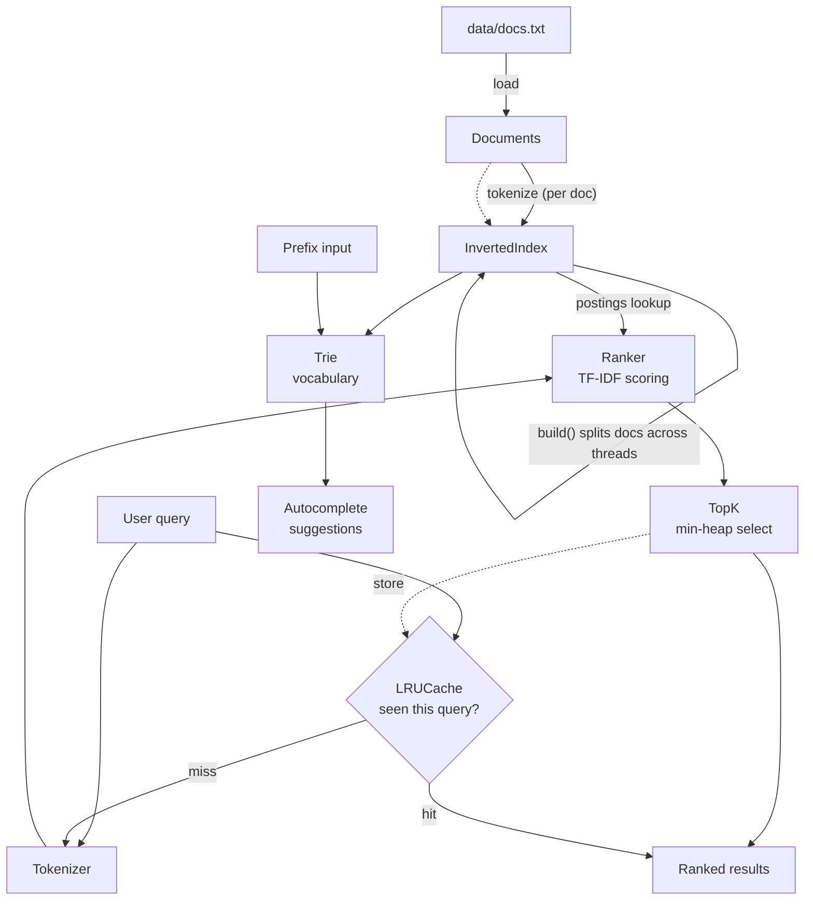

# SearchX

A search engine built from scratch in C++20 — inverted index, TF-IDF ranking,
min-heap top-K selection, Trie autocomplete, a hand-built LRU cache, and
multithreaded indexing. No database, no web framework, no external libraries:
just the STL, to keep every data structure decision visible and explainable.

Built as a portfolio/interview project, not a production system — see
[Scope & trade-offs](#scope--trade-offs) for what was deliberately left out
and why.

## Architecture



## Tech stack

| Layer | Choice |
|---|---|
| Language | C++20 |
| Core | STL, OOP, templates, smart pointers, RAII |
| Concurrency | `std::async` / `std::thread` (parallel index build) |
| Build | CMake |
| Testing | `assert()` sanity checks |
| Data | Flat text file (`data/docs.txt`), synthetically generated |
| Cache | Hand-built LRU (hash map + doubly linked list) |
| Interface | CLI |

## Build & run

```sh
cmake -S . -B build
cmake --build build

./build/searchx      # interactive search CLI
./build/benchmark    # timing comparison across search strategies
./build/smoke_test   # assert()-based sanity checks for every component
```

CLI commands once running:
- type any text → ranked search (top 5 by TF-IDF)
- `auto <prefix>` → autocomplete suggestions from the Trie
- `stats` → LRU cache hit/miss counts
- `quit` → exit

To regenerate the sample dataset: `python data/generate_dataset.py`
(writes 3000 synthetic short documents to `data/docs.txt`).

## Benchmark results

Run on this repo's 3000-document dataset, 8 distinct query terms x 20
repeats each (see `benchmark/benchmark.cpp`, output saved in
`benchmark/results.txt`):

| Method | Total time (160 queries) | Per query |
|---|---|---|
| Linear scan (no index) | ~314 ms | ~1964 µs |
| Hash lookup only (index, no ranking) | ~0.003 ms | ~0.02 µs |
| Inverted index + TF-IDF + top-K heap | ~2.0 ms | ~12.8 µs |
| Inverted index + LRU cache (repeat query) | ~0.11 ms | ~0.68 µs |

**~154x** faster going from linear scan to a full ranked search, another
**~18x** on top of that for cached repeat queries.

## Design decisions (why each data structure)

- **Inverted index = `unordered_map<string, unordered_map<docId, freq>>`**
  Hash map gives O(1) average lookup for "which docs contain this word" —
  the whole point of indexing instead of scanning every document per query.
- **TF-IDF ranking** — term frequency rewards documents that mention a query
  word often; inverse document frequency downweights words so common
  they're not useful for distinguishing documents (`log((N+1)/(df+1)) + 1`
  smoothing to stay defined and non-negative).
- **Min-heap top-K (`TopK`)** — once you only need the best `k` results, a
  bounded min-heap is O(n log k) instead of a full O(n log n) sort. Matters
  because `k` (5 shown) stays tiny even as the match count grows.
- **Trie for autocomplete** — a prefix lookup costs O(prefix length) to
  reach the right node, independent of vocabulary size, unlike scanning
  every word for a prefix match.
- **LRU cache (hash map + doubly linked list)** — O(1) get and put; the
  linked list tracks recency (move-to-front on access), the hash map gives
  O(1) jump straight to a node instead of scanning the list.
- **Multithreaded index build** — documents are split into contiguous
  chunks, each thread tokenizes and builds its own local index (no shared
  state, no locking needed), then the partial indexes are merged on the
  main thread.

## Scope & trade-offs

Cut deliberately to keep the project buildable and defensible in a week,
kept as *discussion-only* topics for interviews:

- **No database / disk-backed index** — everything lives in memory, loaded
  from a flat text file. A real engine would need disk-backed postings
  lists and index sharding once the vocabulary + documents don't fit in RAM.
- **No REST API / web frontend** — CLI only. The search/rank/cache logic is
  already separated from I/O (`main.cpp` is the only place that touches
  `std::cin`/`std::cout`), so a REST layer could sit on top without
  touching the core.
- **No Redis** — the LRU cache is in-process and single-instance; a real
  multi-server deployment would need a shared cache.
- **No stopword removal / stemming** — kept the tokenizer simple (lowercase
  + strip punctuation) so TF-IDF behavior stays easy to trace by hand.

### "What happens at 10 million documents?"
The in-memory hash-map index would no longer fit in RAM. The real fix is
**sharding**: split the vocabulary or document range across multiple
machines, route each query to the shards that hold the relevant postings,
and merge partial results — the same divide-and-conquer idea already used
here for multithreaded index *building*, just distributed across machines
instead of threads.

## Resume bullet

> Built SearchX, a high-performance C++ search engine using an inverted
> index and Trie-based autocomplete, achieving 150x+ query speedup over
> linear search via hash-based indexing and a hand-implemented LRU cache;
> parallelized index construction using multithreading.

## Interview Q&A cheat sheet

- **Why a hash map for the inverted index?** O(1) average lookup from term
  → posting list; the alternative (scanning documents) is O(corpus size)
  per query.
- **Why a heap for top-K instead of sorting everything?** O(n log k) vs
  O(n log n) — only matters once k is much smaller than n, which is the
  normal case here (thousands of matches, 5 shown).
- **Time/space complexity?** Indexing: O(total words across all docs) time,
  O(vocabulary size × average posting list length) space. Search: O(query
  terms × average posting list length) to score, O(matches log k) to select
  top-k.
- **What happens at 10 million documents?** See [above](#what-happens-at-10-million-documents) — sharding, disk-backed postings, distributed merge.
- **Why LRU over other eviction policies?** Cheap to implement (O(1) with a
  hash map + linked list) and exploits temporal locality — repeated or
  trending queries are common in real search traffic, which is exactly
  what LRU is good at keeping around.
- **How does TF-IDF work, and its limitations?** TF rewards frequent terms
  in a doc, IDF downweights terms common across the whole corpus. It
  ignores word order, synonyms, and semantic meaning — a plain keyword
  match, not real relevance understanding (that's what embeddings /
  learned ranking models are for).
- **Why split documents by chunk for multithreading instead of locking a
  shared index?** Each thread builds an independent local index with zero
  shared mutable state, so there's no locking overhead during the
  parallel phase — merging happens once, sequentially, at the end.
